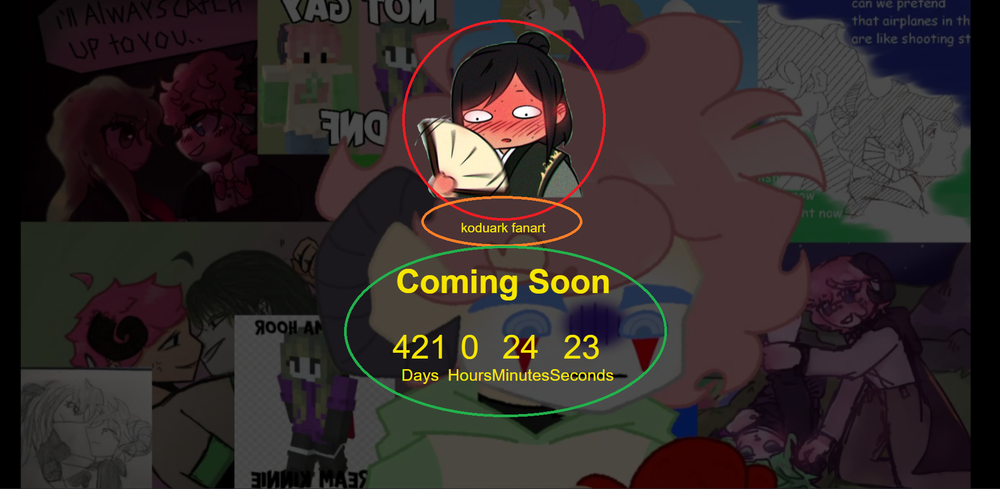

# README file for "Count Down" page 

## Purpose

This page's purpose is to show, when will a collection of KoduArk fanart will come out (and how I coded a count down page.) 

## User personas

User, who will visit this website are:

* Fans of Dawn of SMP
* KoduArk enjoyers
* Artist, to see other people's artwork

## User stories

Right now the only thing that the user can do is watch the countdown and have little sneak peaks from the artwork the page will feature.

## Website structure

On the website there is:

1. **The countdown** (specified in the green circle)
1. **Website's name** (specified in the orange circle)
1. **A little picture of a blushing man** (specified in the red circle)
1. **Sneakpeek of the artwork** (on the very background)

## Non-functional requirements

This website will probably handle a few people and it will work in Edge and Chrome browser.
